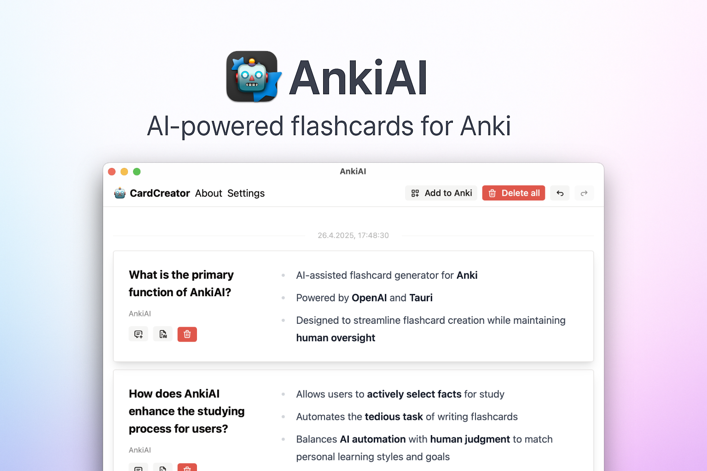
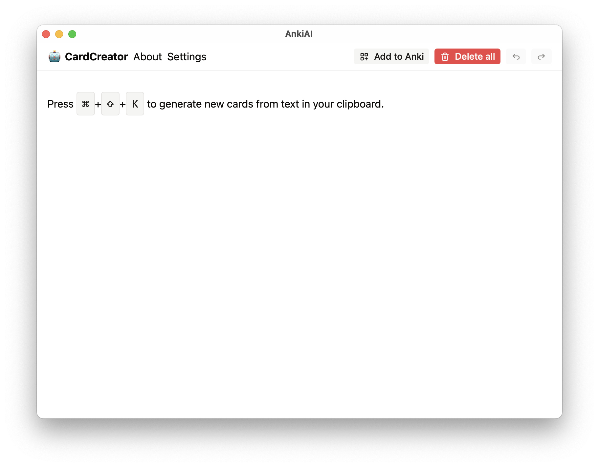
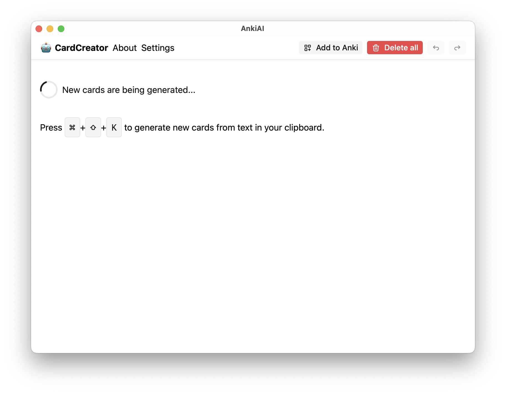
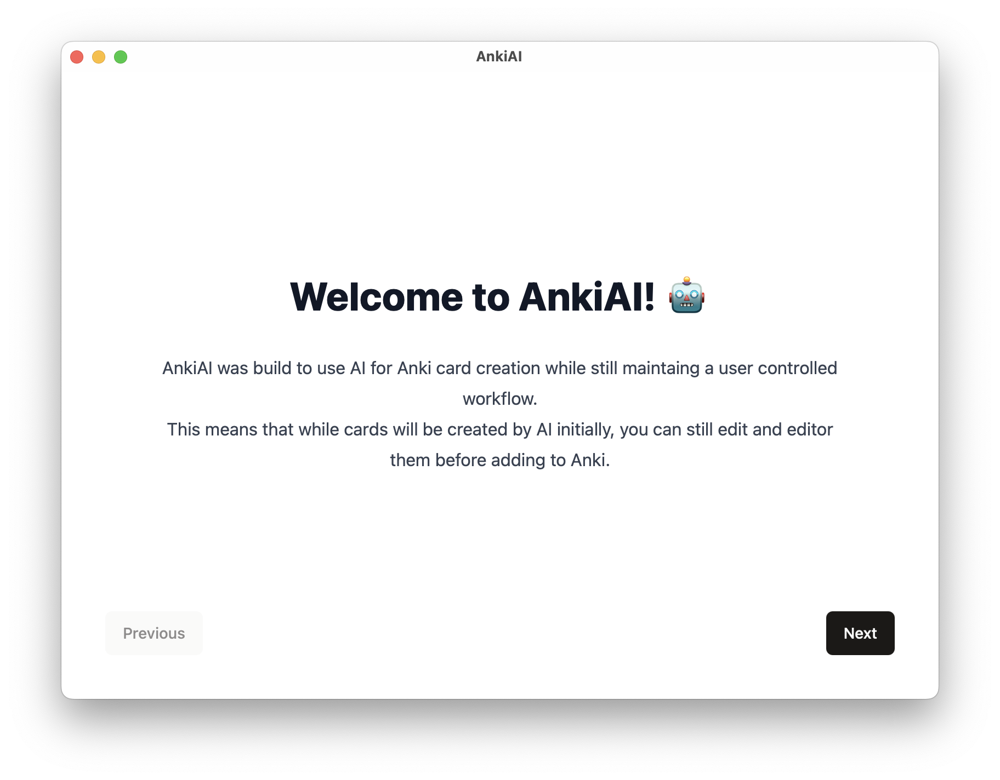
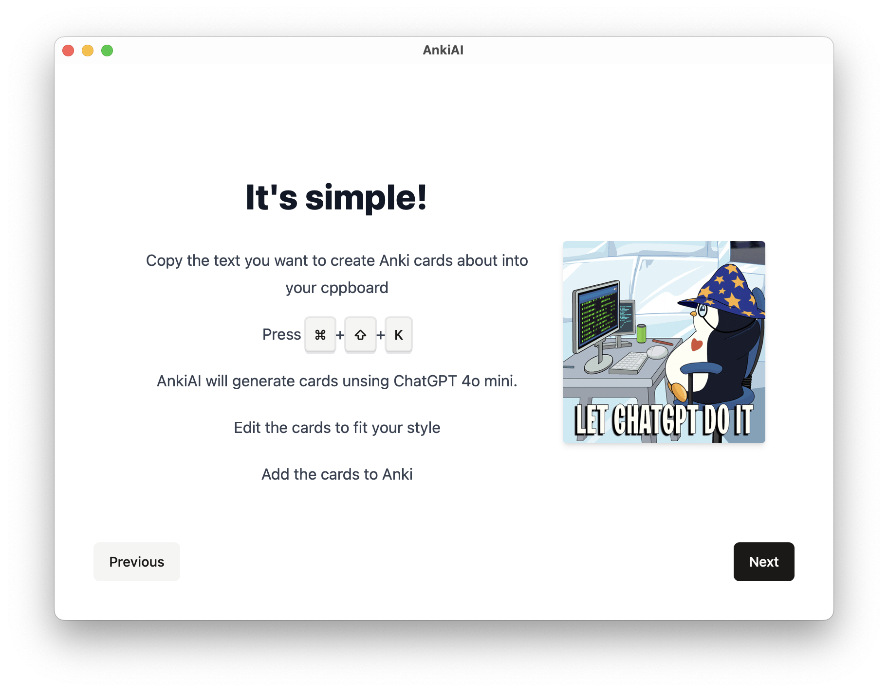
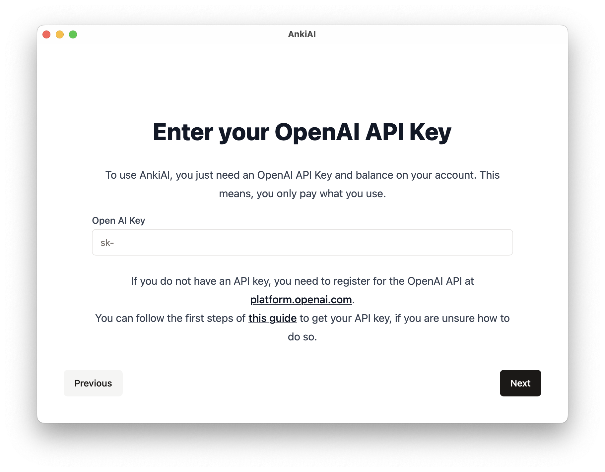
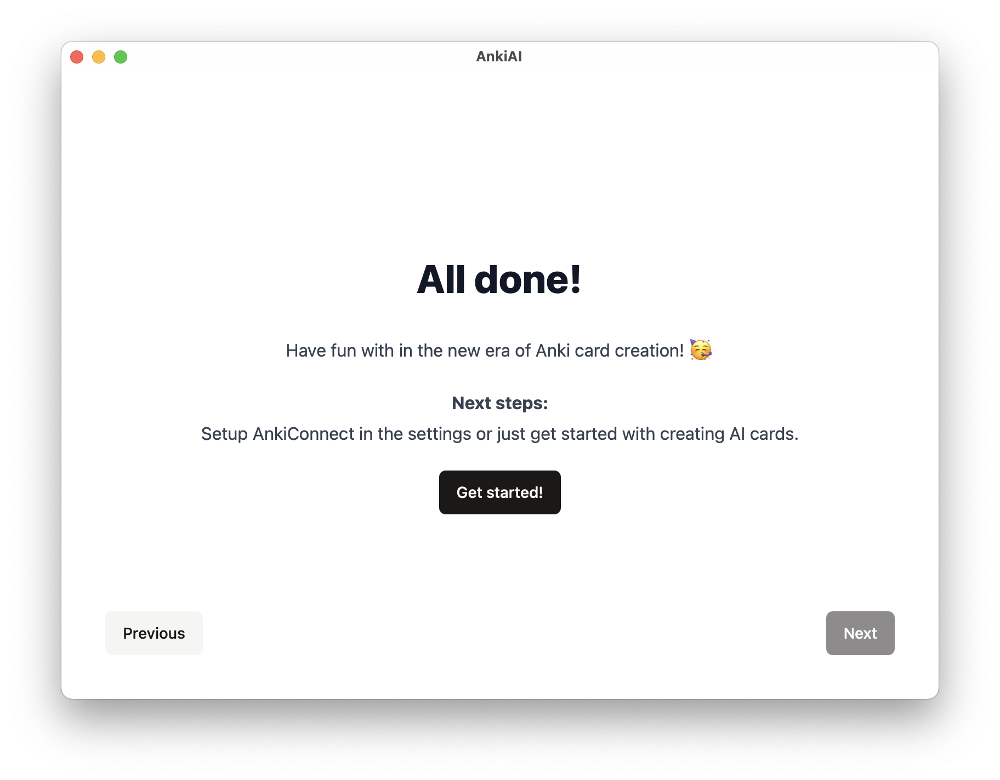

# AnkiAI
✨ AI‑assisted flashcard generator for Anki powered by OpenAI and Tauri.

<p>
  
</p>

## Why AnkiAI?

Studying is most effective when you actively choose the facts you want to remember. **AnkiAI** speeds up the tedious part—writing cards—without taking the decisions away from you.

AnkiAI was built to harness AI for flash‑card creation **without giving up human oversight**.  
The app drafts card suggestions automatically, but you can review, tweak, or ask the AI to
re‑phrase them before they ever reach your collection. This balanced workflow combines the
speed of automation with the precision of human judgment—so every card still matches your
personal learning style and study goals.

## How it works

1. **Select & copy** the sentence(s) you want to learn from anywhere. If you can copy it, you can create a card for it!
2. Hit the **AnkiAI shortcut** (default: ⇧⌘K) to create draft cards from your clipboard using OpenAI GPT‑4o or other models.
3. **Preview & tweak** the cards in the built‑in editor (manually _or_ ask the AI to refine them).
4. **Export** the finished cards straight to Anki through the [AnkiConnect](https://ankiweb.net/shared/info/2055492159) plugin.

## Features

- ✨ GPT‑powered Q ↔ A card templates
- 🖱️ Works with **any app**—if you can copy text, you can make cards
- 🔁 **Inline AI edits** to polish wording or adjust difficulty
- 📦 One‑click **export** that respects decks, tags, and media
- Cross‑platform **Tauri** desktop app (macOS / Windows / Linux)
- 💰 **Running cost summarizer** keeps your OpenAI usage transparent
- 🌙 **Dark mode** for comfortable studying at night
- 🧭 **Guided setup wizard** to get you started in minutes
- 🔧 Change **models** and **global hotkeys** on the fly

## Prerequisites

| Requirement                         | Why                    |
| ----------------------------------- | ---------------------- |
| **OpenAI API key**                  | Generates card content |
| **Anki** 2.1+ with **AnkiConnect**  | Receives the cards     |
| **Node.js** ≥ 20 (includes **npm**) | Build / run the app    |
| **Rust** toolchain                  | Required by Tauri      |

## Getting started

```bash
# clone
git clone https://github.com/T-Specht/ankiai
cd ankiai-tauri

# install dependencies
npm install

# start in dev mode
npm run tauri dev
```

Create a production build with:

```bash
npm run tauri build
```

## Configuration

All settings can be changed in **Settings** in the UI.

## Screenshots

### Generating cards

<p>
  
  
  
  
  
</p>

### Onboarding

<p>
    
  
  
  
</p>

## License

Copyright © 2025 Tim Specht

Released under the MIT License.
